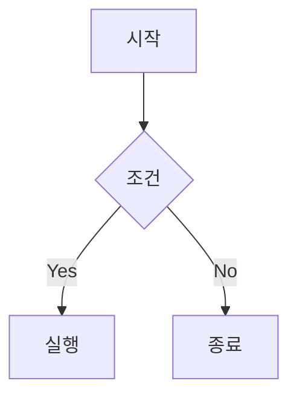
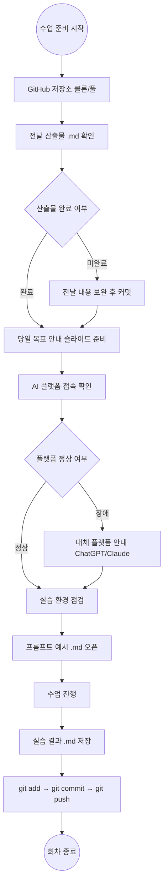
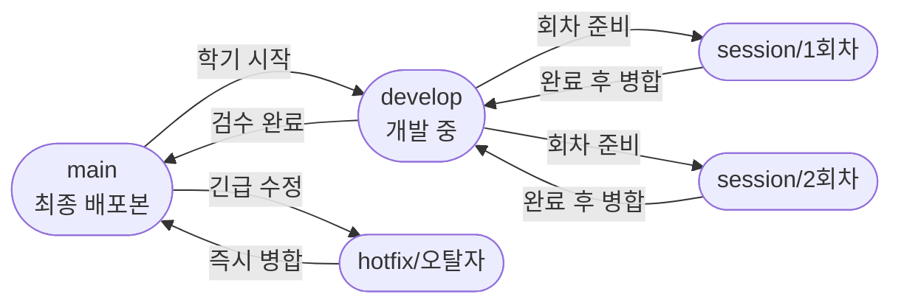
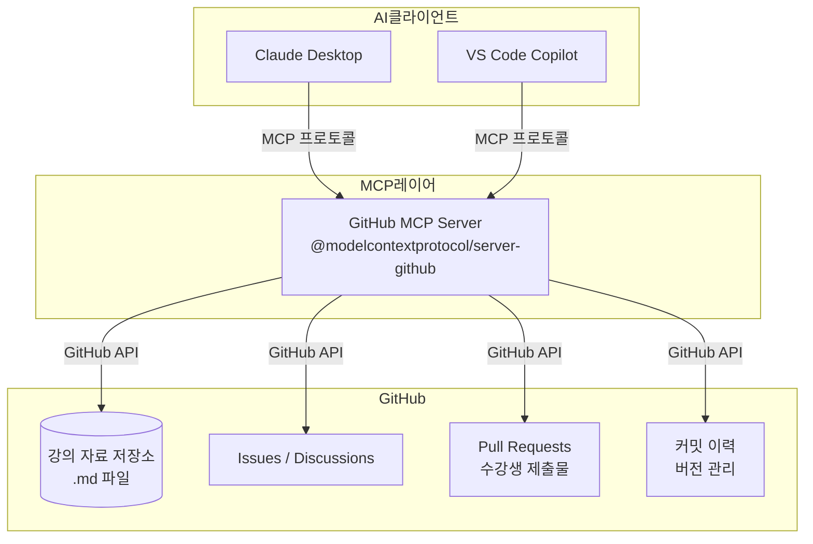
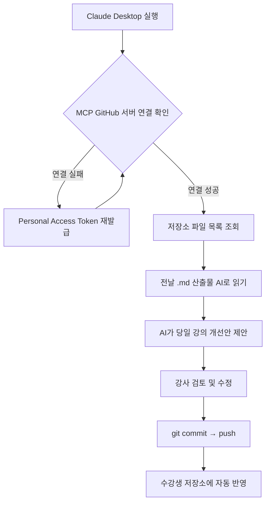

# 제3기 AI ADVANCED 과정 — 공통 교육모듈 커리큘럼

**대상:** 전남대학교 전임교원 70명 (분반별 35명, 2개 분반 동시 운영)  
**기간:** 7/13(월) ~ 7/16(목), 총 4회차 / **20시간**  


> **GitHub 저장소 운영 방침**  
> 본 과정의 모든 강의 자료와 산출물은 GitHub를 통해 공유·관리된다.  
> `.gitignore` 설정으로 **Markdown(`.md`) 파일만 Git으로 공유**하며, PDF·PPT·이미지 등 대용량 파일은 제외한다.

---

## Mermaid 워크플로우 작성 가이드

Mermaid는 Markdown 코드 블록 안에 텍스트로 다이어그램을 작성하는 도구다. GitHub, Notion, Obsidian 등에서 자동 렌더링된다.

### 기본 문법

````markdown

````

### 주요 노드 형태

| 표현 | 의미 |
|------|------|
| `A[텍스트]` | 사각형 (일반 단계) |
| `A(텍스트)` | 둥근 사각형 |
| `A{텍스트}` | 마름모 (조건 분기) |
| `A((텍스트))` | 원 (시작/종료) |
| `A[/텍스트/]` | 평행사변형 (입력/출력) |

### 화살표 종류

| 표현 | 의미 |
|------|------|
| `-->` | 실선 화살표 |
| `-.->` | 점선 화살표 |
| `==>` | 굵은 화살표 |
| `-->|라벨|` | 라벨 있는 화살표 |

---

## 수업 진행 준비 워크플로우



---

## 개요

| 회차 | 일자 | 주제 | 시간 |
|------|------|------|------|
| 1회차 | 7/13(월) | AI 기반 교수 설계 자동화와 프롬프트 전략 + GitHub 환경 구성 | 5H |
| 2회차 | 7/14(화) | 수업 목적별 학습자료 제작 & 수업 운영 전략 및 AI 보안 | 5H |
| 3회차 | 7/15(수) | 평가 설계 AI 활용 | 5H |
| 4회차 | 7/16(목) | AI 품질 관리 및 윤리·수업 혁신 프로토콜 | 5H |

---

## 멀티플랫폼 운용 전략 — 9개 AI 모델 교수 업무별 라우팅

본 과정은 교수 업무 맥락에 따라 최적의 도구를 선택·활용하는 **공통 원리와 구조**를 중심으로 설계한다.  
특정 플랫폼에 종속되지 않도록 아래 9개 모델의 강점을 교수 업무에 매핑하여 활용한다.

| AI 모델 | 교수 맥락별 강점 | 활용 영역 |
|---------|----------------|----------|
| **ChatGPT** | 논리적 구조화, 범용성 | 강의 계획서, 시험 문항, 설문 초안, Q&A |
| **Claude** | 고급 문체, 비판적 분석 | 논문서론, 루브릭, 피드백 생성, 오류 탐지 |
| **Gemini** | 멀티모달, 정보 통합 | 강의 슬라이드, 개념 시각화, 학습자료 구조 설계 |
| **Qwen** | 난이도 조정, 교육형 변환 | 학부생↔대학원생 버전 변환, 활동지 수준 조정 |
| **Solar** | 한국어 맥락 최적화 | 보고서, 계획서 한국어 문체 교정 |
| **Grok** | 빠른 정보 요약, 트렌드 반영 | 최신 이슈 강의 사례 발굴, 수업 혁신 사례 탐색 |
| **Llama** | 오픈 소스 기반 비교 | 프롬프트 비교 실험, 모델 비교, 민감 데이터 로컬 처리 |
| **Mistral** | 경량, 압축형 문장 | 짧은 피드백, 메타 데이터, 복습 퀴즈 해설 |
| **Perplexity** | 사실 검증, 출처 기반 | 선행 연구 탐색, 수치 교차 검증, 학습자료 팩트 체크 |

---

## GitHub 강의 산출물 버전 관리 전략

강의 자료는 매 학기·회차마다 개선된다. Git 버전 관리를 활용하면 개선 전후를 정확히 추적하고, 필요 시 이전 버전으로 복구하며, 강사 간 협업도 가능하다.

### 브랜치 전략



| 브랜치 | 역할 | 사용 시점 |
|--------|------|----------|
| `main` | 최종 배포본 — 수강생 공유용 | 회차 종료 후 병합 |
| `develop` | 강의 자료 개발 중 | 강의 준비 전 기간 |
| `session/N회차` | 특정 회차 자료 작업 | 회차별 독립 작업 |
| `hotfix/*` | 긴급 수정 (오탈자, 링크 오류) | 즉시 수정 필요 시 |

### 커밋 메시지 규칙

| 태그 | 의미 | 예시 |
|------|------|------|
| `feat:` | 새 강의 내용 추가 | `feat: 3회차 루브릭 실습 추가` |
| `fix:` | 오류·오탈자 수정 | `fix: 2회차 프롬프트 예시 오류 수정` |
| `update:` | 기존 내용 개선 | `update: 1회차 AI 모델 라우팅 최신화` |
| `refactor:` | 구조 재편성 | `refactor: 회차별 폴더 구조 정리` |

### 버전 태깅 — 학기별 스냅샷

```bash
# 학기 최종본 태깅
git tag -a v1.0-2025-1 -m "2025년 1학기 공통과정 최종본"
git push origin v1.0-2025-1

# 태그 목록 확인
git tag -l

# 특정 학기 버전으로 복구
git checkout v1.0-2025-1
```

### 강의 개선 이력 확인 명령어

```bash
# 특정 .md 파일의 변경 이력 조회
git log --oneline -- 1회차_강의안.md

# 두 버전 간 내용 차이 비교
git diff v1.0-2025-1 v2.0-2025-2 -- 1회차_강의안.md

# 특정 커밋 시점의 파일 내용 확인
git show HEAD~3:1회차_강의안.md
```

---

## GitHub Codex MCP 서버 활용

### MCP(Model Context Protocol)란?

MCP는 AI 모델이 외부 도구·저장소·서비스에 표준화된 방식으로 접근할 수 있게 하는 오픈 프로토콜이다. **GitHub 공식 MCP 서버**를 설정하면 Claude·Copilot 등의 AI가 저장소 파일을 직접 읽고, 이슈를 생성하고, PR을 관리할 수 있다.

### 전체 아키텍처



### Claude Desktop + GitHub MCP Server 설정

`~/.config/claude/claude_desktop_config.json`에 추가:

```json
{
  "mcpServers": {
    "github": {
      "command": "npx",
      "args": ["-y", "@modelcontextprotocol/server-github"],
      "env": {
        "GITHUB_PERSONAL_ACCESS_TOKEN": "ghp_xxxxxxxxxxxx"
      }
    }
  }
}
```

> GitHub Personal Access Token 발급: **Settings → Developer settings → Personal access tokens → Fine-grained tokens**  
> 필요 권한: `Contents (Read/Write)`, `Issues (Read/Write)`, `Pull requests (Read/Write)`

### VS Code + GitHub Copilot MCP 설정

저장소 루트에 `.vscode/mcp.json` 파일 생성:

```json
{
  "servers": {
    "github": {
      "type": "http",
      "url": "https://api.githubcopilot.com/mcp/",
      "headers": {
        "Authorization": "Bearer ${env:GITHUB_TOKEN}"
      }
    }
  }
}
```

### 강의 자료 AI 보조 활용 사례

| 활용 시나리오 | AI 지시 프롬프트 예시 | 효과 |
|-------------|---------------------|------|
| **강의안 자동 개선** | "이 저장소의 1회차 .md를 읽고 학습 목표를 Bloom 6단계로 재작성해" | 기존 파일 기반 AI 개선 |
| **회차 변경 요약** | "main 브랜치 최근 커밋 5개를 강의 개선 관점으로 요약해" | 강의 이력 파악 |
| **수강생 PR 리뷰** | "이 PR의 .md 파일 변경사항을 검토하고 피드백을 작성해" | 제출물 AI 피드백 |
| **이슈 자동 답변 초안** | "이 Issue의 질문에 대한 답변 초안을 강의 자료를 참고해 작성해" | Q&A 자동화 |
| **강의안 버전 비교** | "v1.0과 v2.0 태그 간 1회차 자료의 주요 변경점을 비교해줘" | 개선 내용 파악 |

### MCP 활용 수업 준비 워크플로우



---

## 1회차 · 7/13(월) — AI 기반 교수 설계 자동화와 프롬프트 전략 + GitHub 환경 구성 `5H`

### 시간대별 운영 계획

| 시간 | 내용 | 형태 |
|------|------|------|
| 13:00–13:20 | 오리엔테이션: 전체 과정 구조, 8일 로드맵, GitHub 운영 방침 안내 | 전체 |
| 13:20–14:30 | **GitHub 환경 구성 + Git 기초**: 계정 생성, 저장소 클론, `.gitignore` 이해, 첫 커밋 실습 | 강의+실습 |
| 14:30–14:40 | 휴식 | |
| 14:40–15:40 | **AI/LLM 원리 + 토큰 경제학 + 9개 모델 라우팅**: 생성형 AI 작동 원리, 한국어 토큰 소모량(영어의 3~5배), 컨텍스트 윈도우, Gemini 모델 라인업(Ultra·Pro·Flash·Nano) | 강의 |
| 15:40–16:00 | **실습**: ChatGPT·Claude·Gemini 3종에 동일 프롬프트 입력 → 반응 차이 비교 분석 | 실습 |
| 16:00–16:50 | **CRGR + PTCF 프롬프트 엔지니어링**: 맥락(C)·참조(R)·목표(G)·역질문(R) 프레임워크, PTCF(Persona·Task·Context·Format) 단계적 지시 기법, 교수 목적 기반 프롬프트 유형 분류 | 강의+실습 |
| 16:50–17:50 | **Bloom 분류학 + 강의 계획서 AI 생성**: Bloom 기반 학습 목표 재작성, 16주 강의 계획서 초안 AI 생성, 수업목표↔강의안↔평가 정합성 자가 검증 | 실습 |
| 17:50–18:00 | 산출물 `.md` 파일 정리 → `git add` → `git commit` → `git push` | 정리 |

### 학습 목표
생성형 AI의 작동 원리를 이해하고, 교수 업무 전반에 적합한 AI 모델을 선택할 수 있다. 교수 설계 중심 프롬프트 엔지니어링 역량을 습득하고, Bloom 분류학 기반 교수 설계 문서를 AI로 생성 및 검증한다. GitHub를 통해 과정 자료를 공유·관리하는 기본 워크플로우를 실습한다.

### 세부 교육 내용

#### (0) GitHub 기반 과정 운영 환경 구성
- **Git/GitHub 기본 개념**
  - Git: 파일의 변경 이력을 추적하는 버전 관리 시스템
  - GitHub: Git 저장소를 온라인에서 공유하는 협업 플랫폼
  - 핵심 용어: 저장소(Repository), 커밋(Commit), 푸시(Push), 풀(Pull), 브랜치(Branch)
- **과정 저장소 클론 및 구조 이해**
  - `git clone` 으로 과정 자료 전체 내려받기
  - 디렉터리 구조 확인 및 `.gitignore` 설정 이해 (`.md` 파일만 공유, PDF·PPT 제외)
- **Markdown으로 강의 자료 작성**
  - Markdown 기본 문법: 제목(`#`), 목록(`-`), 표(`|`), 강조(`**`)
  - AI가 생성한 강의 자료를 `.md` 파일로 저장하는 워크플로우
- **기본 Git 명령어 실습**

  | 명령어 | 역할 |
  |--------|------|
  | `git status` | 변경된 파일 목록 확인 |
  | `git add <파일명>` | 커밋할 파일 선택(스테이징) |
  | `git commit -m "메시지"` | 변경 이력 저장 |
  | `git push` | GitHub 원격 저장소에 업로드 |
  | `git pull` | 최신 자료 내려받기 |

- **[실습]** GitHub 저장소 클론 → 본인 소개 `.md` 파일 작성 → `add` → `commit` → `push` 전체 흐름 실습

#### (1) AI/LLM 작동 원리와 교수 맥락 이해
- 토큰화, 확률 기반 생성, 문맥 유지 방식 등 핵심 원리
- 생성형 AI의 한계와 오류 유형 (Hallucination 포함)
- **토큰 경제학**: 한국어 1글자 ≈ 1.22 토큰 (영어의 3~5배 소모) → 실질 컨텍스트 20~30만 글자
- Gemini 모델 라인업: Ultra(최고 성능) / Pro(균형) / Flash(속도) / Nano(온디바이스)
- 9개 AI 모델 교수 업무별 라우팅 원칙 이해
- **[실습]** ChatGPT·Claude·Gemini 3종에 동일 프롬프트를 입력하여 반응 차이 비교 분석

#### (2) 교수 설계 중심 프롬프트 엔지니어링
- **CRGR 프레임워크**: 상황(Context) → 참조(Reference) → 목표(Goal) → 역질문(Reverse Q)
- **PTCF 프레임워크**: Persona(역할) · Task(작업) · Context(맥락) · Format(형식)
- 교수 목적 기반 프롬프트 유형 분류 (수업설계용 / 평가용 / 연구용)
- 모델별 최적 활용: 수업설계 → ChatGPT / 강의 슬라이드 → Gemini / 루브릭 → Claude / 팩트체크 → Perplexity
- **[실습]** 본인 교과목의 수업 목표를 3개 모델에서 각각 생성·비교

#### (3) 교수 설계 문서 체계 & Bloom 분류학
- 교수 설계 핵심 문서 체계 정리 (수업계획서, 강의안, 평가계획)
- 계열별 학습 목표 작성 및 관행 차이 비교
- Bloom 기반 목표 표현 변환 실습
- **[실습]** 본인 교과목의 학습 목표를 Bloom 분류학 기반으로 재작성

#### (4) 강의 계획서·강의안 AI 생성 및 정합성 검점
- 16주차 강의 계획서 AI 초안 생성
- 수업 목표 → 강의안 → 평가 문항 간 정합성 검점 기법
- AI 모델 비교 분석 결과와 개인 프롬프트 레시피 정리
- **[실습]** 본인 교과목 16주 강의 계획서 초안 완성 + 정합성 자가 검증

### 핵심 산출물
- 강의 계획서 및 강의안 초안 (`.md` 파일로 GitHub 저장소에 업로드)
- AI 모델 비교 분석 결과
- 개인 프롬프트 레시피
- GitHub 첫 커밋 완료 (개인 소개 `.md` 파일)

---

## 2회차 · 7/14(화) — 수업 목적별 학습자료 제작 & 수업 운영 전략 및 AI 보안 `5H`

### 시간대별 운영 계획

| 시간 | 내용 | 형태 |
|------|------|------|
| 13:00–13:10 | 전날 산출물 GitHub 확인, 당일 목표 안내 | 전체 |
| 13:10–14:10 | **학습자료 유형 + Gems PTCF 설계**: 3단계 체계화(도입·전개·정리), Google Gems 루브릭 설계 PTCF 활용, Qwen 난이도 조정, Grok 최신 사례 | 강의 |
| 14:10–14:20 | 휴식 | |
| 14:20–15:20 | **NotebookLM 7가지 업로드 + 9가지 스튜디오**: PDF·URL·YouTube·Drive 업로드, AI 오디오 오버뷰·슬라이드·마인드맵·퀴즈·플래시카드 생성 | 강의+실습 |
| 15:20–16:00 | **실습**: 수업 단계별 학습자료 3종 (도입·전개·정리) AI 생성 및 상호 피드백 | 실습 |
| 16:00–17:00 | **AI 통합 수업 운영 전략**: TimelyGPT 4단계 마스터리(기본 상호작용→템플릿→Labs→에이전트), 수업 단계별 AI 활용 프레임워크, 학습자 참여 유도 전략 | 강의+실습 |
| 17:00–17:50 | **AI 보안 + 프롬프트 인젝션 & 방어**: 보안 위협 유형, 익명화 처리, Llama 로컬 처리, 인젝션 공격 시도 → 방어 모델 작성 | 강의+실습 |
| 17:50–18:00 | 산출물 정리 → GitHub 커밋·푸시 | 정리 |

### 학습 목표
수업 목표에 맞는 학습 자료를 AI로 제작하고, 수업 단계별 AI 활용 운영 전략을 수립한다. AI 보안 공격 유형을 이해하고 방어 프롬프트를 설계할 수 있다.

### 세부 교육 내용

#### (1) 수업 목적별 학습자료 유형과 설계 원칙
- 수업 목적별 학습자료 3단계 체계화 (도입·전개·정리)
- 효과적인 학습자료의 4대 요건
- 멀티미디어 학습자료 AI 제작 가능성과 한계
  - Gemini: 강의 슬라이드·개념 시각화 / Qwen: 난이도별 활동지 버전 제작
  - Mistral: 복습 퀴즈·짧은 요약 / Grok: 최신 사례 기반 학습자료
- **[실습]** 강의안 초안을 기반으로 다양한 학습자료 AI 제작

#### (2) NotebookLM 활용 수업 자료 관리
- **7가지 업로드 방법**: PC 파일(PDF·Word·PPT·CSV·MP3), HWP→PDF 변환, 웹 URL, YouTube URL, 텍스트 붙여넣기, Google Drive, Discover Sources
- **9가지 스튜디오 기능**: AI 오디오 오버뷰 / 슬라이드 자료 / 동영상 개요 / 마인드맵 / 보고서 / 인포그래픽 / 플래시카드 / 퀴즈 / 데이터 표
- **[실습]** 수업 단계별 학습자료 3종 AI 생성 및 상호 피드백

#### (3) AI 활용 수업 운영 전략
- **TimelyGPT 4단계 마스터리**: 기본 상호작용(AI Chat·RAG) → 프롬프트 자동화(Templates) → 멀티모달 확장(Labs·Canvas) → 워크플로우 자동화(AI Agents)
- 수업 단계별 AI 활용 전략 프레임워크 수립
- AI 통합 수업 운영 시나리오 작성 및 구성항목 정리
- 학습자 참여 유도형 AI 활용 전략
- **[실습]** AI 통합 수업 운영 시나리오 완성

#### (4) AI 보안, 프롬프트 인젝션 & 방어
- AI 보안의 이해와 프롬프트가 공격 대상인 이유
- 교수 업무 AI 보안 위협 유형 (개인정보·연구 데이터·성적 AI 입력 금지)
- 프롬프트 인젝션의 이해, 주요 공격 사례 및 유형 분석
- 민감 데이터 처리 시 Llama(로컬 처리) 활용 원칙
- 익명화 처리 및 방어 프롬프트 설계 실습
- **[실습]** 프롬프트 보안 실습 — 인젝션 공격 시도 및 방어 모델 작성

### 핵심 산출물
- 수업 단계별 학습자료 3종
- AI 통합 수업 운영 시나리오
- AI 보안 체크리스트 & 프롬프트 인젝션 로컬모델
- 프롬프트 보안 실습 보고서

---

## 3회차 · 7/15(수) — 평가 설계 AI 활용 `5H`

### 시간대별 운영 계획

| 시간 | 내용 | 형태 |
|------|------|------|
| 13:00–13:10 | 전날 산출물 GitHub 확인, 당일 목표 안내 | 전체 |
| 13:10–14:10 | **평가 설계 원리 + CA 관점 검점**: 진단·형성·총괄 평가, AI 활용 가능/불가 영역 구분, Constructive Alignment 3요소(LO·TLA·AT) 일관성 점검 | 강의 |
| 14:10–14:20 | 휴식 | |
| 14:20–15:30 | **Google Gems 루브릭 설계 + 계열별 평가 문항 생성**: PTCF 기반 젬스 지침 설계, 4단계 분석적 루브릭 생성, 루브릭 품질 점검 5대 기준 적용, ChatGPT 시험 문항·Claude 루브릭·피드백 분업 | 강의+실습 |
| 15:30–16:00 | **실습**: 본인 교과목 시험 문제 세트 + 4~5단계 채점 루브릭 완성 | 실습 |
| 16:00–17:00 | **학생 피드백 자동 생성 + NotebookLM 평가 자료 관리**: Claude 개인화 피드백, Mistral 압축형 피드백 비교, NotebookLM 퀴즈·플래시카드 자동 생성 | 강의+실습 |
| 17:00–17:50 | **실습**: 학생 피드백 문장집 완성 (3수준 답안 기반) | 실습 |
| 17:50–18:00 | 산출물 정리 → GitHub 커밋·푸시 | 정리 |

### 학습 목표
평가 설계 원리와 AI 활용 범위를 이해하고, 계열별 평가 문항과 루브릭을 AI로 생성하며, 학생 피드백 문장을 자동 생성할 수 있다.

### 세부 교육 내용

#### (1) 평가 설계 원리와 AI 활용 범위
- 평가 유형 분류: 진단·형성·총괄 평가 / 직접·간접 평가 / 진정성 평가
- AI 활용 가능 영역과 교수자 판단이 필수인 영역 구분
- **[실습]** 본인 교과목의 평가 체계를 CA 관점에서 검점

#### (2) Google Gems 루브릭 설계 + 계열별 평가 문항 생성
- **PTCF 기반 젬스 지침 설계**: Persona(교육공학 전문가) · Task(4단계 루브릭 초안) · Context(강의 대상·수준) · Format(마크다운 표)
- **루브릭 품질 점검 5대 기준**: 학습 성과 일관성 / 수준 간 변별력 / 긍정적 언어 / Bloom 정렬 / 형평성·포용성
- 시험 문항 생성 → ChatGPT / 루브릭·피드백 → Claude (고급 문체·비판적 분석)
- Bloom 분류 기반, 계열별 유형 반영 평가 문항 설계
- **[실습]** 본인 교과목 시험 문제 세트 + 채점 루브릭 완성

#### (3) 학생 피드백 문장 자동 생성 실습
- 샘플 학생 답안 3수준에 대한 개인화 피드백 AI 생성 (Claude 활용)
- Mistral을 활용한 압축형 짧은 피드백 문장 비교 생성
- 피드백의 구체성·건설성·학습 지향성 검증
- **[실습]** 학생 피드백 문장집 완성

### 핵심 산출물
- 시험 문제 세트 (Bloom 분류 기반, 계열별 유형 반영)
- 4~5단계 채점 루브릭
- 학생 피드백 문장집

---

## 4회차 · 7/16(목) — AI 품질 관리 및 윤리·수업 혁신 프로토콜 `5H`

### 시간대별 운영 계획

| 시간 | 내용 | 형태 |
|------|------|------|
| 13:00–13:10 | 전날 산출물 GitHub 확인, 당일 목표 안내 | 전체 |
| 13:10–14:20 | **AI 품질 관리 원칙 + 오류 탐지 실습**: 사실 정확성·학문적 타당성·편향 탐지 기준, 문서 유형별 품질 기준 차이, 재생성 루프, Perplexity 교차 검증 | 강의+실습 |
| 14:20–14:30 | 휴식 | |
| 14:30–15:20 | **AI 기반 수업 혁신 + 교수자 역할 변화**: 지식 전달자→학습 설계자·큐레이터, 3단계 피드백 사이클(AI 1차→학생 검토→교수자 심층), AI-Resistant 평가 설계, 국내외 대학 혁신 사례(Grok 탐색) | 강의 |
| 15:20–16:00 | **AI 저작권 + 학문적 무결성**: 2025년 최신 판례(Getty Images v. Stability AI, Bartz v. Anthropic), 학문적 무결성 3유형(Learning Aid·AI-Integrated·Ethics Only), 대학 정책 현황 | 강의 |
| 16:00–17:00 | **개인 AI 활용 교수 프로토콜 수립**: AI 리터러시 4대 영역(기술적·비판적·윤리적·교육적), 교과목별 AI 활용 범위·도구·검증 절차·윤리 기준 작성 | 실습 |
| 17:00–17:40 | **계열별 최종 발표 (2인 1조 피어리뷰)** | 발표 |
| 17:40–18:00 | 전체 공통 과정 회고 + GitHub 최종 커밋·푸시 | 정리 |

### 학습 목표
AI 생성 결과물의 품질 관리 기준을 이해하고 오류 탐지 실습을 수행한다. AI 기반 수업 혁신 방향을 이해하고, 개인 맞춤 AI 활용 교수 프로토콜을 수립한다.

### 세부 교육 내용

#### (1) AI 생성 텍스트 품질 관리 원칙 및 오류 탐지 실습
- 품질 관리 기준: 사실 정확성·학문적 타당성·편향 탐지
- 문서 유형별 품질 검점 기준 차이 (수업자료 vs 연구 보고서 vs 행정 문서)
- 재생성 루프: 오류 발견 → 수정 지시 → 재생성 → 재검토
- 사실 검증 시 Perplexity (출처 기반) 교차 확인 실습
- **[실습]** AI 생성 텍스트에서 사실 오류·논리 비약·편향 탐지 실습

#### (2) AI 기반 수업 혁신 방향과 적용 사례
- AI 시대 교수자 역할 변화: 지식 전달자 → 학습 설계자·큐레이터
- **3단계 피드백 사이클**: Step 1(AI) 1차 기초 피드백 → Step 2(학생) 비판적 검토·수정 → Step 3(교수자) 심층 피드백·통찰
- 국내외 대학 AI 기반 수업 혁신 사례 분석 (Grok 활용 최신 트렌드 탐색)
- AI 기반 수업 혁신의 현실적 방향 도출

#### (3) AI 활용 교수 윤리와 정책 이해
- **2025년 최신 AI 저작권 판례**: Getty Images v. Stability AI / Bartz v. Anthropic / US Copyright Office 보고서
- 학술 저작 AI 활용 공시 기준
- **학문적 무결성 3유형**: Learning Aid(아이디어·문법만 허용) / AI-Integrated(대화 로그 제출) / Ethics Only(개인정보 금지·출처 의무)
- 대학 차원의 AI 활용 정책 현황 분석

#### (4) AI 활용 교수 프로토콜 수립 & 최종 발표
- **AI 리터러시 4대 영역**: 기술적(프롬프트 엔지니어링) / 비판적(Hallucination 인지) / 윤리적(저작권·편향) / 교육적(강의 설계 통합)
- 9개 모델 라우팅 기반 개인 맞춤 AI 활용 교수 프로토콜 완성
- **계열별 최종 발표 진행 (2인 1조 피어리뷰)**

### 핵심 산출물
- 품질 검증 비교 보고서
- **개인 맞춤 AI 활용 교수 프로토콜 문서**

---

## 회차별 산출물 요약

| 회차 | 일자 | 핵심 산출물 |
|------|------|------------|
| 공통 1 | 7/13 | 강의 계획서 및 강의안 초안 (GitHub 업로드), AI 모델 비교 분석 결과, 개인 프롬프트 레시피 |
| 공통 2 | 7/14 | 수업 단계별 학습자료 3종, AI 통합 수업 운영 시나리오, AI 보안 체크리스트 |
| 공통 3 | 7/15 | 시험 문제 세트, 채점 루브릭, 학생 피드백 문장집 |
| 공통 4 | 7/16 | 품질 검증 비교 보고서, **개인 맞춤 AI 활용 교수 프로토콜** |

---

## 교수 페르소나 예시 10선

공통 과정에서 활용하는 AI 페르소나. PTCF 프레임워크의 **Persona** 요소로 프롬프트 앞에 삽입하여 사용한다.

| # | 페르소나 | 프롬프트 설정 문구 |
|---|---------|-----------------|
| 1 | **교육과정 설계 전문가** | "당신은 20년 경력의 교육공학 전문가입니다. Constructive Alignment 원리에 따라 학습 목표·활동·평가의 정합성을 분석하고 개선안을 제시하십시오." |
| 2 | **Bloom 분류학 코치** | "당신은 Bloom의 개정 분류학 전문가입니다. 제시된 학습 목표가 어느 인지 수준(기억·이해·적용·분석·평가·창조)에 해당하는지 진단하고 상위 수준으로 향상시키는 대안 문장을 3개 제시하십시오." |
| 3 | **루브릭 설계 컨설턴트** | "당신은 대학 교수 평가 전문가입니다. 제시된 과제 설명서를 분석하여 4단계(미흡·보통·우수·탁월) 분석적 루브릭을 마크다운 표 형식으로 생성하십시오. 각 수준의 설명은 관찰 가능한 행동 지표로 작성하십시오." |
| 4 | **강의 계획서 검증 도우미** | "당신은 대학 교수학습개발원 컨설턴트입니다. 제시된 강의 계획서의 수업 목표·주차별 내용·평가 방법 간 논리적 일관성을 점검하고 개선이 필요한 항목을 구체적으로 지적하십시오." |
| 5 | **학습자료 큐레이터** | "당신은 멀티미디어 교육 콘텐츠 전문가입니다. 제시된 강의 주제에 맞는 도입·전개·정리 단계별 학습자료 유형을 추천하고, 각 자료의 AI 제작 가능 수준과 한계를 명시하십시오." |
| 6 | **개인화 피드백 생성 전문가** | "당신은 학습 코치입니다. 아래 학생 답안을 읽고 구체성·건설성·학습 지향성을 갖춘 개인화 피드백을 3~5문장으로 작성하십시오. 학생의 노력을 인정하는 문장으로 시작하십시오." |
| 7 | **AI 보안 전문가** | "당신은 AI 보안 및 프롬프트 엔지니어링 전문가입니다. 교수 업무 환경에서 발생할 수 있는 프롬프트 인젝션 공격 유형을 3가지 설명하고, 각각에 대한 방어 프롬프트 설계 방법을 제시하십시오." |
| 8 | **수업 혁신 코치** | "당신은 AI 기반 고등교육 혁신 전문가입니다. 제시된 교과목의 기존 강의 방식을 분석하고, AI를 활용하여 학습자 참여를 30% 이상 높일 수 있는 수업 운영 시나리오를 3단계로 제안하십시오." |
| 9 | **AI 품질 감수자** | "당신은 학술 문서 편집 전문가입니다. 아래 AI 생성 텍스트에서 (1) 사실 오류, (2) 논리 비약, (3) 편향적 표현을 각각 식별하고, 수정된 문장을 함께 제시하십시오." |
| 10 | **교수 윤리 가이드** | "당신은 대학 AI 활용 정책 전문가입니다. 제시된 수업 상황에서 AI 활용의 학문적 무결성 위반 여부를 판단하고, 적절한 공시 방법과 학생 안내 문구를 작성하십시오." |

---

## 프롬프트 예시 10선

공통 과정 4회차에 걸쳐 바로 사용할 수 있는 실전 프롬프트.

### ① 강의 계획서 초안 생성
```
당신은 대학 교육과정 설계 전문가입니다.
아래 정보를 바탕으로 16주 강의 계획서 초안을 마크다운 표 형식으로 작성하십시오.

- 교과목명: [교과목명]
- 대상: [학년, 전공]
- 주요 학습 목표 (3개): [목표1 / 목표2 / 목표3]
- 평가 방법: [중간고사 30%, 기말고사 30%, 과제 40%]

각 주차에는 주제, 학습 목표(Bloom 동사 포함), 주요 활동, 사전 학습 자료를 포함하십시오.
```

### ② Bloom 분류학 기반 학습 목표 재작성
```
다음 학습 목표를 Bloom의 개정 분류학 6단계(기억·이해·적용·분석·평가·창조) 기준으로 분류하고,
현재 수준보다 한 단계 높은 상위 인지 활동을 포함하는 개선된 목표 문장을 3가지 제안하십시오.

현재 학습 목표: [기존 학습 목표 입력]
대상 수준: [학부/대학원], 전공: [전공명]
```

### ③ 수업 단계별 학습자료 생성
```
당신은 멀티미디어 교육 콘텐츠 전문가입니다.
아래 강의 주제에 대해 수업 3단계(도입·전개·정리)에 맞는 학습자료를 각 1종씩 생성하십시오.

강의 주제: [주제]
수강자 수준: [학부 2학년]
수업 시간: [75분]

- 도입(15분): 흥미 유발을 위한 사례 또는 질문 자료
- 전개(50분): 핵심 개념 설명을 위한 구조화된 학습지
- 정리(10분): 핵심 내용 3줄 요약 + 복습 퀴즈 3문항
```

### ④ 계열별 채점 루브릭 생성
```
당신은 대학 평가 설계 전문가입니다.
아래 과제에 대한 4단계(미흡·보통·우수·탁월) 분석적 루브릭을 마크다운 표로 생성하십시오.

과제 설명: [과제 내용]
평가 항목 4가지: [내용의 정확성 / 논리적 구성 / 비판적 사고 / 표현의 명확성]
각 수준 설명은 관찰 가능한 행동 지표로, 긍정적·성장 지향적 언어로 작성하십시오.
```

### ⑤ 개인화 학생 피드백 생성
```
당신은 학습 코치입니다. 아래 학생 답안을 읽고 구체적이고 건설적인 피드백을 작성하십시오.

[학생 답안]: [답안 내용]
[채점 기준]: [루브릭 또는 기준]
[학생 수준]: [현재 점수 또는 수준]

피드백 조건:
- 학생의 노력을 인정하는 문장으로 시작
- 잘한 점 1가지 구체적으로 언급
- 개선이 필요한 점 2가지 + 개선 방법 제시
- 격려하는 문장으로 마무리
- 전체 5~7문장
```

### ⑥ AI 생성 텍스트 품질 검증
```
당신은 학술 문서 품질 관리 전문가입니다.
아래 AI 생성 텍스트를 다음 3가지 기준으로 점검하고, 각 항목별로 문제 문장과 수정안을 제시하십시오.

[AI 생성 텍스트]: [텍스트 입력]

점검 기준:
1. 사실 정확성: 수치·날짜·고유명사 오류 여부
2. 논리 비약: 근거 없이 결론으로 도약한 구절
3. 편향적 표현: 특정 관점만 반영된 단정적 언어
```

### ⑦ AI 활용 수업 운영 시나리오 작성
```
당신은 AI 기반 고등교육 혁신 전문가입니다.
아래 교과목의 75분 수업에서 AI를 단계별로 활용하는 운영 시나리오를 작성하십시오.

교과목: [교과목명]
주차 주제: [해당 주제]
수강 인원: [명]
활용 가능 AI 도구: ChatGPT, Gemini, NotebookLM

시나리오 형식:
- 도입(10분): AI 활용 방법
- 전개(55분): AI 보조 활동 2~3단계
- 정리(10분): AI로 학습 확인
- 교수자 역할과 AI 역할을 명확히 구분하여 작성
```

### ⑧ 프롬프트 인젝션 방어 모델 작성
```
당신은 AI 보안 전문가입니다.
교수 업무에서 사용하는 아래 프롬프트에 대한 인젝션 공격 시나리오를 작성하고,
이를 방어하는 강화된 프롬프트 버전을 제시하십시오.

원본 프롬프트: [교수가 사용하는 프롬프트]

방어 요소를 포함하십시오:
- 역할 고정 (Role Anchoring)
- 입력값 범위 제한
- 출력 형식 고정
- 이탈 시 응답 거부 조건
```

### ⑨ 개인 AI 활용 교수 프로토콜 문서화
```
당신은 교육 혁신 컨설턴트입니다.
아래 정보를 바탕으로 본인 교과목에 맞는 AI 활용 교수 프로토콜을 마크다운 문서로 작성하십시오.

- 교과목명 및 특성: [입력]
- 주로 사용하는 AI 도구: [입력]
- AI 활용 주요 업무: [강의 준비 / 평가 / 피드백 / 연구]

프로토콜 포함 항목:
1. 교과목별 AI 활용 범위 및 제한
2. 단계별 검증 절차 (사실 확인 → 품질 검점 → 윤리 검토)
3. 학생 대상 AI 사용 정책 공지 문구
4. 비상 시 대체 도구 목록
```

### ⑩ 강의안 정합성 검점
```
당신은 교육과정 정합성 검증 전문가입니다.
아래 세 문서를 비교하여 논리적 일관성 여부를 판단하고 불일치 항목을 구체적으로 지적하십시오.

[학습 목표]: [입력]
[강의안 주요 내용]: [입력]
[평가 문항 또는 과제]: [입력]

검점 기준:
- 학습 목표에 명시된 역량이 강의안에서 다루어지는가?
- 평가가 학습 목표와 강의 내용을 실질적으로 측정하는가?
- Bloom 분류학 기준으로 목표·활동·평가의 인지 수준이 일치하는가?
```

